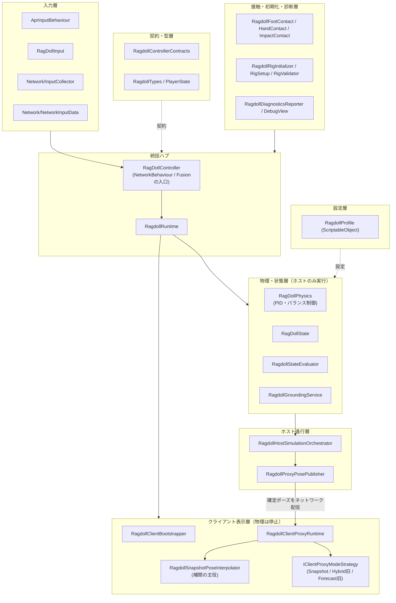

# アーキテクチャ俯瞰（アクティブラグドール ネットワーク物理同期）

> **このドキュメントの役割**: 個々のdevlogを読む前に「森」を見るための1枚。
> 「なぜこの設計か」の詳細な経緯は各devlogに委ね、ここでは**現在の到達点**だけを短くまとめる。

## ひとことで言うと

このプロジェクトは、**物理で立ったり転んだりする人形（アクティブラグドール）** を **Photon Fusion 2** で複数人に同期している。

最大の難所は「ホストの画面ではなめらかなのに、クライアントの画面ではカクつく／発散する」問題。理由と現在の解決策は次の通り。

## なぜクライアント予測が使えないか

アクティブラグドールは多数の関節が絡む [※理論] カオス系（初期値鋭敏性）に近く、ごくわずかな計算誤差がすぐ大きな姿勢のズレに育つ。そのため「各クライアントが自分でも物理を計算して予測する」方式は構造的に発散しやすい。

実際、Photon FusionのForecast Physics（外挿ベースの予測）は [`2026-03-24_forecast_physics_ab_test_setup.md`](devlogs/2026-03-24_forecast_physics_ab_test_setup.md) でA/Bテスト環境を作り、[`2026-03-27_syncmetrics_baseline_measurement.md`](devlogs/2026-03-27_syncmetrics_baseline_measurement.md) の計測で「kinematic + PID方式が全指標で勝利」という結果になり、2026-03-28に不採用が確定した。

> [※未確認] `Docs/TECHNICAL_DESIGN.md` の1.2節はこの決定以前の記述のまま「Forecast Physicsで対処」と書かれており、現状と食い違っている。更新が必要な既知の齟齬として記録しておく。

## 現在の同期方式：スナップショット補間

1. **ホスト（StateAuthority）だけが物理を実際に計算する。** クライアントは物理計算を止める。
2. ホストは確定した全身ポーズをネットワークに流す。
3. クライアントは、すでに届いている**2つの確定ポーズの「間」**を描画のたびに滑らかに繋いで表示する（予測ではなく補間）。

この方式は実運用アセット `Assets/Settings/MainPlayer_AprProfile.asset` で `ProxySyncMode.SnapshotInterpolation` として明示的に選択されている。

> **既知の非対称に注意**: `RagdollProfile.cs` のコード上のデフォルト値は `Hybrid`（クライアントもローカル物理を動かす旧方式）のままだが、実運用設定ではSnapshotInterpolationに上書きされている。`Hybrid` / `Forecast` の戦略クラス（`HybridClientProxyModeStrategy.cs` / `ForecastClientProxyModeStrategy.cs`）はコード上まだ存在するが、現行運用では使われていない旧経路。

## クラス構成（責務層）

- **入力層**: キー・マウス入力をネットワーク送信可能な形にまとめる入口
- **契約・型層**: クラス間の「約束」（インターフェース）と共通の型。`RagdollControllerContracts` が要
- **設定層**: `RagdollProfile`（全パラメータの置き場、`ProxySyncMode`もここで定義）
- **統括ハブ**: `RagDollController`（Fusionの`NetworkBehaviour`、14個のインターフェースを実装し全サブシステムを結線）と `RagdollRuntime`
- **物理・状態層**: ホストだけが実行する「本物」の物理計算
- **ホスト進行層**: 毎tickの処理をまとめ、結果ポーズを配信
- **クライアント表示層**: 受け取ったポーズをなめらかに見せる工夫の集まり。`RagdollSnapshotPoseInterpolator` が中心
- **接触・初期化・診断層**: 接地/掴み/衝撃判定（いずれもホスト権威）とリグ初期化・デバッグ表示

> 元は `RagDollPhysics` / `RagDollController` / `RagdollProfile` の3ファイルだったが、2026年3〜4月にかけて責務ごとに分割され、現在`Assets/Code/Scripts/Player/`配下は38ファイル構成になっている（詳細な1クラスごとの解説は今のところ用意していない。深掘りが要る場合はdevlogか`.claude/rules/network.md`/`.claude/rules/physics.md`を参照）。

## もっと詳しく知りたいとき

- 同期方式決定の経緯: [`2026-03-27_syncmetrics_baseline_measurement.md`](devlogs/2026-03-27_syncmetrics_baseline_measurement.md)
- ボトルネック解消の経緯: [`2026-04-11_physics_sync_bottleneck_analysis.md`](devlogs/2026-04-11_physics_sync_bottleneck_analysis.md)
- ピア間同期の純補間化: [`2026-06-18_peer_sync_pure_interpolation.md`](devlogs/2026-06-18_peer_sync_pure_interpolation.md)
- より詳細な技術説明: `Docs/TECHNICAL_DESIGN.md`
