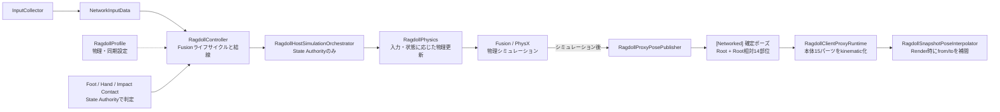

# Bungling Delvers — アクティブラグドール同期の全体像

> **最終確認:** 2026-07-22
>
> 個別のdevlogを読む前に、現在のプレイヤー同期方式と主要クラスの役割を把握するための資料です。

## ひとことで言うと

Bungling Delversは、物理で立ち、転び、物を掴むアクティブラグドールをPhoton Fusion 2で同期しています。

プレイヤー本体の物理結果はState Authorityだけが確定します。クライアントは本体15パーツを再シミュレーションせず、受信済みの確定ポーズを描画時に補間します。これにより、ホストとクライアントが別々に多関節物理を計算して姿勢が発散する問題を避けています。

## 現在方式へ至った経緯

設計判断は2段階です。

1. **2026年3月 — Forecast Physicsを不採用**

   Forecast Physicsと、当時のkinematic＋補正方式を30秒の2インスタンス環境で比較しました。このリグと設定ではForecast側の位置誤差、回転誤差、overshootが大きかったため不採用としました。これは「あらゆるラグドールで予測が使えない」という結論ではありません。
2. **2026年6月 — 全身スナップショット補間へ移行**

   当時の補正方式には、描画フレーム間の補間がない、同期がRoot・頭・両手に限られる、残りの部位がローカル物理で発散する、という別の問題がありました。そこで、Rootと14部位の確定ポーズを送り、クライアントの`Render()`で補間する現在方式へ変更しました。

詳しい測定条件は[`2026-03-27_syncmetrics_baseline_measurement.md`](devlogs/2026-03-27_syncmetrics_baseline_measurement.md)、現在方式の実装は[`2026-06-10_client_snapshot_interpolation.md`](devlogs/2026-06-10_client_snapshot_interpolation.md)に記録しています。

## 現在のデータフロー

処理順の要点は次の通りです。

1. `InputCollector`がローカル入力を`NetworkInputData`へ変換する
2. State Authorityの`RagdollHostSimulationOrchestrator`が入力を読み、状態と物理更新を進める
3. Fusionの物理シミュレーション後に`RagdollProxyPosePublisher`が確定ポーズを公開する
4. クライアントの`RagdollSnapshotPoseInterpolator`が、受信済みの2スナップショット間を描画フレームごとに補間する

## 同期対象とローカル物理の境界

- **プレイヤー本体15パーツ**: クライアントではkinematic。ホストの確定ポーズを補間表示する
- **装飾Rigidbody**: ゲーム結果を決めない二次運動として、クライアントでもローカル物理を続ける
- **掴み・接地・衝撃判定**: State Authority上で判定する
- **Cubeなどの同期物理オブジェクト**: プレイヤーとは別の補間経路を持つ。この差による表示ずれは既知の制約

「クライアントの物理をすべて止める」のではなく、ゲームプレイ上の正解となる本体物理と、見た目だけの装飾物理を分けています。

## 主要クラスの役割

- `RagdollController`: Fusionの`NetworkBehaviour`。ライフサイクルの入口、同期プロパティ、各サブシステムの結線を担当
- `RagdollRuntime`: `RagdollInput`、`RagdollState`、`RagdollPhysics`を生成して初期化
- `RagdollHostSimulationOrchestrator`: State Authority側で入力をコマンドへ変換し、状態評価と物理更新を進行
- `RagdollProxyPosePublisher`: 物理シミュレーション後のRootと14部位のポーズを同期状態へ書き込む
- `RagdollClientProxyRuntime`: クライアント本体の物理状態と表示経路を管理
- `RagdollSnapshotPoseInterpolator`: Fusionのfrom/toスナップショットを読み、描画ポーズを補間
- `RagdollProfile`: 物理調整値と同期方式の設定を保持
- `RagdollControllerContracts.cs`: Controllerと各サブシステムの間で使う小さなcontext interfaceを定義するファイル

クラス名のファイルには一部`RagDoll*.cs`という旧表記が残っていますが、C#の型名は`Ragdoll*`へ統一しています。

## 公開抜粋について

開発中の実行Profileでは`SnapshotInterpolation`を選択しています。公開リポジトリには実行Profile、シーン、Prefab、Photonアプリ設定のすべては含めていないため、公開コードはアーキテクチャと主要処理を読むための抜粋です。

比較用の`Hybrid`と`Forecast`経路はコード上に残っていますが、現在の実行方式ではありません。現在方式の制約と未検証事項は[`ARCHITECTURE_FAILURE_MODES.md`](ARCHITECTURE_FAILURE_MODES.md)に分けて記載しています。

## もっと詳しく知りたいとき

- 現在の全身スナップショット補間: [`2026-06-10_client_snapshot_interpolation.md`](devlogs/2026-06-10_client_snapshot_interpolation.md)
- Forecast Physicsとの比較: [`2026-03-27_syncmetrics_baseline_measurement.md`](devlogs/2026-03-27_syncmetrics_baseline_measurement.md)
- 物理オブジェクトとの補間差: [`2026-06-18_peer_sync_pure_interpolation.md`](devlogs/2026-06-18_peer_sync_pure_interpolation.md)
- 本人による掴みジョイント検証の振り返り: [`AUTHOR_NOTE.md`](AUTHOR_NOTE.md)
