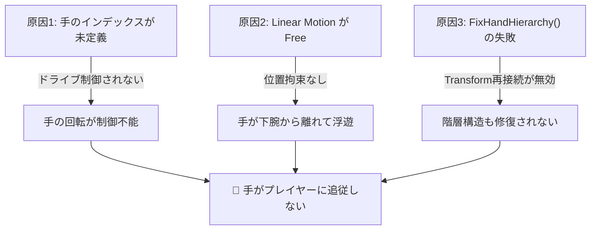

# 開発ログ: 2026-02-11 - APR_LeftHand / APR_RightHand が追従しない問題の修正

## はじめに — このレポートの目的

このレポートは「手がプレイヤーに追従しない」問題について、
**なぜ起きたのか？何が何に影響して？どう直したのか？** を
ステップバイステップで理解するための技術解説です。

---

## 1. 症状の整理 🔎

ゲーム開始時（Spawn直後）から、APR_LeftHand と APR_RightHand だけが
身体から離れて浮いたまま動かず、プレイヤーの移動に追従しなかった。

**他のパーツ（腕・脚・頭など）は正常に追従していた。**

→ つまり「手だけが特別に壊れている何か」がある。

---

## 2. APRラグドールの仕組みを理解する 📖

修正を理解するには、まずAPR（Active Physical Ragdoll）の基本構造を知る必要がある。

### 2-1. 身体パーツの接続構造

APRラグドールは、複数のRigidbody（物理ボディ）を **ConfigurableJoint** で鎖のように繋いでいる。

```
APR_Root（腰）
 ├── APR_Body（胴体）
 │    └── APR_Head（頭）
 ├── APR_UpperRightArm（右上腕）
 │    └── APR_LowerRightArm（右下腕）
 │         └── APR_RightHand（右手）  ← ★ここが問題
 ├── APR_UpperLeftArm（左上腕）
 │    └── APR_LowerLeftArm（左下腕）
 │         └── APR_LeftHand（左手）   ← ★ここが問題
 ├── APR_UpperRightLeg（右太もも）
 │    └── APR_LowerRightLeg（右すね）
 │         └── APR_RightFoot（右足）
 └── APR_UpperLeftLeg（左太もも）
      └── APR_LowerLeftLeg（左すね）
           └── APR_LeftFoot（左足）
```

### 2-2. ConfigurableJoint の2つの重要な設定

各パーツの ConfigurableJoint には、大きく分けて **2つの設定カテゴリ** がある：

| 設定 | 役割 | 例 |
|------|------|-----|
| **Linear Motion** (x/y/zMotion) | パーツの **位置** をどの程度拘束するか | `Locked` = 接続先から離れない / `Free` = 自由に飛んでいける |
| **Angular Drive** (angularXDrive等) | パーツの **回転** をどの程度制御するか | `positionSpring` が高い = 強く元の姿勢に戻ろうとする |

**ポイント💡**: どちらかが正しくても、もう一方が壊れていればパーツは正しく動かない。

### 2-3. ジョイントドライブの管理方法

コード上では、全パーツを `bodyJoints[]` 配列で管理し、
各パーツに **インデックス番号** でアクセスしている：

```csharp
private const int IndexRoot = 0;           // 腰
private const int IndexBody = 1;           // 胴体
private const int IndexHead = 2;           // 頭
private const int IndexUpperRightARM = 3;  // 右上腕
private const int IndexLowerRightARM = 4;  // 右下腕
private const int IndexUpperLeftARM = 5;   // 左上腕
private const int IndexLowerLeftARM = 6;   // 左下腕
private const int IndexUpperRightLeg = 7;  // 右太もも
private const int IndexLowerRightLeg = 8;  // 右すね
private const int IndexUpperLeftLeg = 9;   // 左太もも
private const int IndexLowerLeftLeg = 10;  // 左すね
private const int IndexRightFoot = 11;     // 右足
private const int IndexLeftFoot = 12;      // 左足
// ❌ 手（Hand）のインデックスが存在しない！
```

---

## 3. 原因の特定 — 3つの連鎖する問題 🔗

問題は単一の原因ではなく、**3つの原因が連鎖**して発生していた。



### 原因1: 手がジョイントドライブ管理の対象外だった ⚠️

**何が起きていたか：**

`RagDollPhysics.cs` にはドライブ（関節の硬さ）を設定する処理が3箇所ある：

1. `ApplyInitialDrives()` — スポーン時の初期設定
2. `DeactivateRagdoll()` — ラグドール解除時の復帰
3. `ApplyBlendedJointDrives()` — 毎フレームのドライブ調整

しかし、**3箇所すべてで手（Hand）が処理されていなかった**。

```csharp
// ApplyInitialDrives() の中身を見ると…
_bodyJoints[IndexUpperRightARM].angularXDrive = _poseOn;  // ✅ 上腕
_bodyJoints[IndexLowerRightARM].angularXDrive = _poseOn;  // ✅ 下腕
// ❌ IndexRightHand が存在しないため、手のドライブが設定されない！
```

**なぜこうなったか：**

インデックス定数にそもそも `IndexRightHand` / `IndexLeftHand` が定義されていなかった。
おそらく最初の設計時に手を独立パーツとして扱う必要がないと判断し、
後から掴み機能（`RagdollHandContact.cs`）を追加した際にドライブ管理の追加を忘れた。

**結果：**

手のConfigurableJointの `angularXDrive` / `angularYZDrive` が初期値（ほぼ0）のまま →
手を元のポーズに戻すバネ力がゼロ → 回転が全く制御されない。

---

### 原因2: Linear Motion を `Free` に設定していた 🚨

**何が起きていたか：**

`RagDollController.cs` の `SetupHandJoints()` で、手のジョイントの
Linear Motion（位置の拘束）を `Free`（自由移動）に設定していた：

```csharp
// 変更前（問題のコード）
rightHandJoint.xMotion = ConfigurableJointMotion.Free;  // X軸方向に自由移動
rightHandJoint.yMotion = ConfigurableJointMotion.Free;  // Y軸方向に自由移動
rightHandJoint.zMotion = ConfigurableJointMotion.Free;  // Z軸方向に自由移動
```

**なぜこれが問題か：**

ConfigurableJointの `xMotion/yMotion/zMotion` は、接続先（下腕）からの
**位置的な距離の制約** を決める設定。

| 設定 | 意味 | 結果 |
|------|------|------|
| `Locked` | 接続先との位置関係を完全に固定 | 手は下腕にぴったりくっつく ✅ |
| `Limited` | ある程度の範囲内で移動可能 | 手は一定範囲で動ける |
| `Free` | 完全に自由 | 手はどこまでも離れていける ❌ |

`Free` なので、手は（ドライブもなく）**重力に引かれてどこまでも落ちていく**状態だった。

**他のパーツはなぜ大丈夫だったか：**

他のパーツ（腕、脚など）は、Inspector上でMotionが `Locked` に設定されていた。
手だけがコード内で明示的に `Free` に上書きされていたため、手だけが離脱した。

---

### 原因3: `FixHandHierarchy()` がサイレントに失敗していた ⚠️

**何が起きていたか：**

手の階層構造を修復しようとする `FixHandHierarchy()` メソッドが存在していたが、
内部で `transform.Find("APR_LowerLeftArm")` を使っていた。

```csharp
// 問題のコード
Transform lowerLeftArm = transform.Find("APR_LowerLeftArm");
```

**なぜ失敗するか：**

`Transform.Find()` は **直接の子オブジェクトしか検索しない**。
APR_LowerLeftArm は `APR_Root > APR_UpperLeftArm > APR_LowerLeftArm` という
ネストされた階層にあるため、**常に `null` が返る**。

さらに、この後に呼ばれる `DetachRootFromParent()` が APR_Root をワールド直下に
切り離すため、仮に検索できていたとしてもタイミング的な問題があった。

**結果：**

`null` が返るため `if (lowerLeftArm != null && ...)` の条件が `false` になり、
手の再接続処理が**何のエラーも出さずにスキップ**されていた。

---

## 4. 修正内容のステップバイステップ解説 🔧

### Step 1: 手のインデックス定数を追加

**ファイル**: `Assets/Code/Scripts/Player/RagDollPhysics.cs`

```csharp
// 追加（Index 12 の次）
private const int IndexRightHand = 13;
private const int IndexLeftHand = 14;
```

**これにより：** コード上で手のジョイントに名前でアクセスできるようになった。

### Step 2: 3箇所のドライブ設定に手を追加

**ファイル**: `Assets/Code/Scripts/Player/RagDollPhysics.cs`

#### (a) `ApplyInitialDrives()` — スポーン時

```csharp
// 追加
if (IndexRightHand < _bodyJoints.Length && _bodyJoints[IndexRightHand] != null)
{
    _bodyJoints[IndexRightHand].angularXDrive = _poseOn;
    _bodyJoints[IndexRightHand].angularYZDrive = _poseOn;
}
if (IndexLeftHand < _bodyJoints.Length && _bodyJoints[IndexLeftHand] != null)
{
    _bodyJoints[IndexLeftHand].angularXDrive = _poseOn;
    _bodyJoints[IndexLeftHand].angularYZDrive = _poseOn;
}
```

#### (b) `DeactivateRagdoll()` — ラグドール解除時

同様の処理を追加。ラグドール状態から復帰する際にも手のドライブが正しく復元される。

#### (c) `ApplyBlendedJointDrives()` — 毎フレームのブレンド

```csharp
// 追加
ApplyJointDrive(IndexRightHand, adjustedPoseOn);
ApplyJointDrive(IndexLeftHand, adjustedPoseOn);
```

**これにより：** 手の回転が他のパーツと同じ強さで制御されるようになった。

### Step 3: Linear Motion を `Free` → `Locked` に変更

**ファイル**: `Assets/Code/Scripts/Player/RagDollController.cs`

```diff
-rightHandJoint.xMotion = ConfigurableJointMotion.Free;
-rightHandJoint.yMotion = ConfigurableJointMotion.Free;
-rightHandJoint.zMotion = ConfigurableJointMotion.Free;
+rightHandJoint.xMotion = ConfigurableJointMotion.Locked;
+rightHandJoint.yMotion = ConfigurableJointMotion.Locked;
+rightHandJoint.zMotion = ConfigurableJointMotion.Locked;
```

**これにより：** 手が下腕から位置的に離れられなくなった。

### Step 4: `FixHandHierarchy()` を削除

**ファイル**: `Assets/Code/Scripts/Player/RagDollController.cs`

- メソッド本体を削除
- `Spawned()` からの呼び出しを削除

**理由：**

- `transform.Find()` がサイレントに失敗しており、実質的に何もしていなかった
- 手の接続は Step 3 の `connectedBody` + `Locked Motion` で物理的に保証される
- 不要なコードを残すと、将来のデバッグ時に混乱の原因になる

### Step 5: Inspector 側の設定（手動）

Unity Editorで、プレイヤープレファブの以下の配列に手を追加：

| 配列 | [13] に設定 | [14] に設定 |
|------|-------------|-------------|
| `bodyParts` | APR_RightHand | APR_LeftHand |
| `bodyRigidbodies` | RightHand の Rigidbody | LeftHand の Rigidbody |
| `bodyJoints` | RightHand の ConfigurableJoint | LeftHand の ConfigurableJoint |

---

## 5. なぜ他のパーツでは問題が起きなかったのか？ 🤔

この疑問は理解を深めるのに重要。

| パーツ | インデックス | ドライブ設定 | Linear Motion | 結果 |
|--------|------------|-------------|---------------|------|
| 上腕 | 3, 5 | ✅ 毎フレーム適用 | Locked (Inspector) | ✅ 正常 |
| 下腕 | 4, 6 | ✅ 毎フレーム適用 | Locked (Inspector) | ✅ 正常 |
| 足 | 11, 12 | ✅ 毎フレーム適用 | Locked (Inspector) | ✅ 正常 |
| **手** | **未定義** | **❌ 未適用** | **Free (コード上書き)** | **❌ 浮遊** |

手だけが「インデックス未定義 **かつ** Motionを `Free` にコード上書き」という
**二重の障害** を抱えていたため、手だけが壊れた。

---

## 6. 学びとポイント 💡

### 📌 配列インデックスの管理は全パーツを網羅すべき

新しいパーツを追加した時（掴み機能のために手を追加した時）、
物理制御側（`RagDollPhysics.cs`）にもインデックスを追加する必要があった。

### 📌 `ConfigurableJointMotion.Free` は危険

ほとんどのAPRラグドールでは、パーツ間の Linear Motion は `Locked` にするべき。
`Free` にすると物理的に分離してしまう。

### 📌 `Transform.Find()` は直接の子しか検索しない

深い階層のオブジェクトを探すには `transform.Find("parent/child/target")` と
パスで指定するか、別の検索方法（`GetComponentInChildren` 等）を使う必要がある。

### 📌 サイレント失敗は最も危険なバグ

`FixHandHierarchy()` はエラーを出さずに何もしなかった。
`null` チェック後に何も起きない場合は、少なくともログを出すべき。

---

**修正日**: 2026-02-11  
**修正ファイル**:

- `Assets/Code/Scripts/Player/RagDollPhysics.cs`
- `Assets/Code/Scripts/Player/RagDollController.cs`
