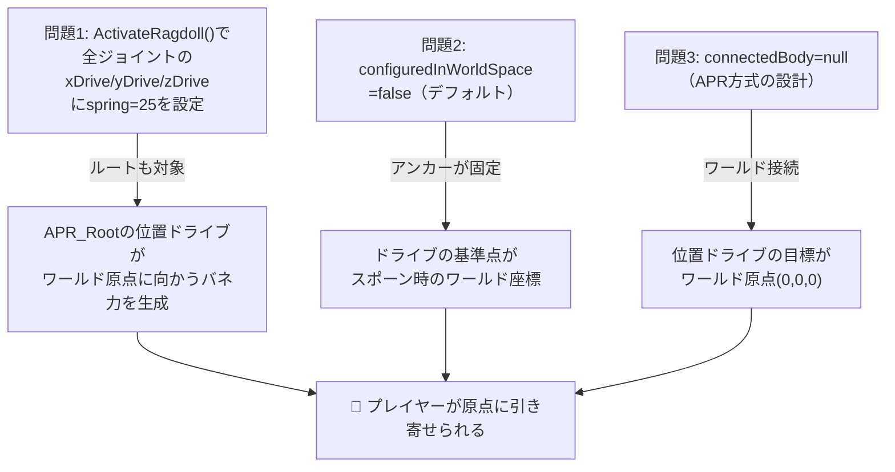

# 開発ログ: 2026-02-12 - プレイヤーがワールド原点に引っ張られるバグの修正

## 1. 症状（何が起きていたか）

テストプレイ中に以下の症状が発生：
- プレイヤー（APRラグドール）がゲーム開始後、**ワールド原点 (0, 0, 0) に向かって徐々に引き寄せられる**
- スポーン位置が原点から離れているほど、引っ張る力が強くなる
- 移動操作をしても原点方向への力に逆らえず、正常にプレイできない

**再現手順:**
1. Unity EditorでPlayモードを開始
2. プレイヤーがスポーンされる
3. プレイヤーが原点方向にじわじわと引き寄せられていくのを確認

---

## 2. 調査プロセス（どうやって原因を特定したか）

[※推測] 以下は修正コードの内容から推測した調査プロセス。

### 最初の仮説
プレイヤーの位置を制御する物理コード（RagDollPhysics.cs）に、原点方向への力を加えるような処理があるのではないか。

### 調査手順
1. **移動処理の確認**: `ProcessMovement()` などで誤った力の方向計算がないか確認 → 移動処理には原点方向への力はなかった
2. **ConfigurableJointの設定確認**: APR_Root（ルートジョイント）の設定を精査
   - `connectedBody=null` であることを確認 → **ワールド空間への接続**
   - `configuredInWorldSpace=false` であることを確認 → **アンカーがスポーン時のローカル座標に固定**
   - `xDrive/yDrive/zDrive` に非ゼロの `positionSpring` が設定されていることを発見
3. **原因の確定**: `connectedBody=null` + 位置ドライブの `positionSpring > 0` = ワールド原点へのバネ力

### 原因の絞り込み
`ActivateRagdoll()` で全ジョイントに一律 `_driveOff`（spring=25, damper=5）を設定していたが、
ルートジョイントは `connectedBody=null` なので、位置ドライブがワールド原点への引力になっていた。

---

## 3. 原因（なぜ起きていたか）

### コードレベルの原因

**3つの問題が連鎖**して発生していた：



#### 問題1: `ActivateRagdoll()` の一律ドライブ設定

```csharp
// 変更前（問題のコード） — RagDollPhysics.cs ActivateRagdoll()
foreach (var joint in _bodyJoints)
{
    if (joint != null)
    {
        joint.slerpDrive = _driveOff;  // ← 全ジョイント一律
        joint.xDrive = _driveOff;      // ← ルートにも positionSpring=25 が設定される！
        joint.yDrive = _driveOff;
        joint.zDrive = _driveOff;
    }
}
```

`_driveOff` は `JointConfigurator.CreateJointDrive(25f, 5f)` で作成され、`positionSpring=25, positionDamper=5` を持つ。
通常のパーツ（腕、脚など）は `connectedBody` が親パーツに設定されているため、この位置ドライブは「接続先パーツへの相対位置バネ」として機能し、問題ない。

**しかし APR_Root だけは `connectedBody=null`**。

#### 問題2: `connectedBody=null` の意味

[※理論] Unity の `ConfigurableJoint` で `connectedBody` が `null` の場合、ジョイントは**ワールド空間に直接接続**される。これは APR ラグドール方式の標準設計で、ルートを物理世界に「浮かせる」ために使われる。

しかし、この状態で `xDrive/yDrive/zDrive` に `positionSpring > 0` を設定すると：
- **ドライブの目標位置 = ジョイントのアンカー位置 = ワールド座標の初期位置（≒ 原点）**
- → バネ力がワールド原点に向かって発生する

#### 問題3: `configuredInWorldSpace=false`（デフォルト値）

[※理論] `configuredInWorldSpace` はジョイントの座標空間を決定するフラグ：

| 値 | 意味 | 位置ドライブの基準 |
|---|---|---|
| `false`（デフォルト） | ジョイント作成時のローカル座標空間 | 生成時の相対位置 |
| `true` | 常にワールド座標空間 | 現在のワールド位置 |

`false` の場合、ジョイントのアンカー計算がスポーン時のワールド座標に固定されるため、
位置ドライブがその座標（原点付近）に引っ張ろうとする。

### 背景にある原理

#### ConfigurableJoint の位置ドライブ（Linear Drive）

[※理論] ConfigurableJoint の `xDrive/yDrive/zDrive` は**位置バネダンパ**として機能する。
物理的には以下の式で力が計算される：

```
F = positionSpring × (targetPosition - currentPosition) - positionDamper × velocity
```

- `connectedBody` がある場合: `targetPosition` は接続先パーツからの相対位置
- `connectedBody=null` の場合: `targetPosition` はワールド空間の固定位置（通常は初期アンカー位置）

したがって、`connectedBody=null` のジョイントに `positionSpring > 0` を設定すると、
ジョイント所有者は常にワールド空間の固定点に引き寄せられる。

#### APR ラグドールのルートジョイントの正しい使い方

[※理論] APR（Active Physical Ragdoll）方式では、ルートジョイント（腰）は：
- **回転ドライブ（angularXDrive/angularYZDrive）**: 使用する → 直立姿勢を維持するトルクを発生
- **位置ドライブ（xDrive/yDrive/zDrive）**: **使用しない** → 位置は重力と足の接地で決まる

ルートの位置を物理ドライブで制御すると、物理シミュレーションの自然さが失われる。

---

## 4. 解決策（何をどう変えたか）

### 修正箇所は3つ

修正は `RagDollPhysics.cs` の3箇所に適用された。
すべて「APR_Root の位置ドライブを確実にゼロにする」という同一方針。

### 修正1: コンストラクタ — スポーン時の防御

**ファイル**: `Assets/Code/Scripts/Player/RagDollPhysics.cs` (L126-151)

```csharp
// ═══════════════════════════════════════════════════════════════
// APR_Root 原点引力バグの修正
// ═══════════════════════════════════════════════════════════════
if (_bodyJoints != null && _bodyJoints.Length > IndexRoot && _bodyJoints[IndexRoot] != null)
{
    _bodyJoints[IndexRoot].configuredInWorldSpace = true;

    // 位置ドライブを完全無効化
    JointDrive zeroDrive = new JointDrive
    {
        positionSpring = 0f,
        positionDamper = 0f,
        maximumForce = 0f
    };
    _bodyJoints[IndexRoot].xDrive = zeroDrive;
    _bodyJoints[IndexRoot].yDrive = zeroDrive;
    _bodyJoints[IndexRoot].zDrive = zeroDrive;
    _bodyJoints[IndexRoot].slerpDrive = zeroDrive;
}
```

#### なぜ `configuredInWorldSpace = true` が必要か

[※理論] `true` に設定することで、ジョイントの座標系がワールド空間に固定される。
これにより、回転ドライブの `targetRotation` が直感的なワールド座標系で解釈される。
APR_Root のように `connectedBody=null` でワールドに直接接続するジョイントでは、
`true` にするのが理にかなっている。

#### なぜ `maximumForce = 0f` も必要か

`positionSpring = 0` だけで十分に思えるが、`maximumForce = 0` も設定することで、
どんな数値的誤差があっても力が発生しないことを保証する防御的プログラミング。

### 修正2: `ActivateRagdoll()` — ラグドール化時のルート特別処理

```csharp
// 変更後 — ActivateRagdoll()
for (int j = 0; j < _bodyJoints.Length; j++)
{
    if (_bodyJoints[j] != null)
    {
        // APR_Root（connectedBody=null）には位置ドライブを設定しない
        // 設定するとワールド原点に引き寄せられるバグが発生する
        if (j == IndexRoot)
        {
            _bodyJoints[j].angularXDrive = _driveOff;    // 回転のみ
            _bodyJoints[j].angularYZDrive = _driveOff;
        }
        else
        {
            _bodyJoints[j].slerpDrive = _driveOff;
            _bodyJoints[j].xDrive = _driveOff;
            _bodyJoints[j].yDrive = _driveOff;
            _bodyJoints[j].zDrive = _driveOff;
        }
    }
}
```

**変更前** は `foreach` で全ジョイント一律に `xDrive/yDrive/zDrive = _driveOff` を設定。
**変更後** は `IndexRoot` だけ特別扱いし、回転ドライブのみ設定。

### 修正3: `DeactivateRagdoll()` — バランス復帰時のゼロクリア

```csharp
// 変更後 — DeactivateRagdoll()
// Root: バランスドライブ（回転のみ、位置ドライブはゼロ）
_bodyJoints[IndexRoot].angularXDrive = _balanceOn;
_bodyJoints[IndexRoot].angularYZDrive = _balanceOn;

// 位置ドライブをゼロクリア（connectedBody=nullなので原点に引っ張られる防止）
JointDrive zeroLinearDrive = new JointDrive
{
    positionSpring = 0f,
    positionDamper = 0f,
    maximumForce = 0f
};
_bodyJoints[IndexRoot].xDrive = zeroLinearDrive;
_bodyJoints[IndexRoot].yDrive = zeroLinearDrive;
_bodyJoints[IndexRoot].zDrive = zeroLinearDrive;
```

**変更前** はルートに `_driveOff`（spring=25）を設定 → 原点引力が発生。
**変更後** は回転ドライブに `_balanceOn` を設定しつつ、位置ドライブは明示的にゼロ。

### コードの各行が「なぜこう書く必要があるか」

| コード | 理由 |
|---|---|
| `configuredInWorldSpace = true` | `connectedBody=null` のジョイントでは、ワールド座標系を基準にするのが正しい |
| `positionSpring = 0f` | バネ力をゼロにして原点への引力を消す |
| `positionDamper = 0f` | 速度に応じた抵抗力も不要（位置制御自体をしない） |
| `maximumForce = 0f` | 防御的に最大力もゼロ（数値誤差対策） |
| `if (j == IndexRoot)` の分岐 | ルートだけが `connectedBody=null` なので、ルートだけ位置ドライブを除外 |

### よくある間違い（アンチパターン）

```csharp
// ❌ 一見正しそうだが危険な書き方
foreach (var joint in _bodyJoints)
{
    joint.xDrive = someJointDrive;  // ← ルートも含む！
    joint.yDrive = someJointDrive;
    joint.zDrive = someJointDrive;
}
```

全ジョイントに一律で位置ドライブを設定するのは危険。
`connectedBody=null` のジョイントが含まれている場合、ワールド原点への引力が発生する。

**正しいパターン**: ルートジョイントは必ず分岐して位置ドライブを除外する。

---

## 5. 検討した代替案

| 代替案 | 評価 | 不採用の理由 |
|--------|------|-------------|
| A: Inspector でルートの xDrive/yDrive/zDrive を手動で 0 に設定 | △ | コードが上書きするので意味がない |
| B: `connectedBody` に空の GameObject を設定 | × | APR 方式の設計を壊す。ルートは自由に動ける必要がある |
| C: `_driveOff` の spring 値を 0 にする | △ | 他パーツの位置ドライブ（親パーツへの追従）も無効化されてしまう |
| D: ルートだけ位置ドライブをゼロ化 + `configuredInWorldSpace=true` ★ | ○ | APR 方式を維持しつつ原点引力を根本的に解消 |

---

## 6. 教訓（今後同様の問題に遭遇したときのヒント）

### このバグのパターン
**「connectedBody=null ジョイントへの一律ドライブ設定」パターン**

ジョイント操作を foreach で一括処理する際、`connectedBody` の有無を考慮しないと、
ワールド接続ジョイント（通常はルート）だけ意図しない挙動を示す。

### 同じパターンのバグに遭遇したときの対処手順
1. **まず確認**: 「原点に引っ張られる」「特定の位置に吸い寄せられる」症状が出たら、
   ConfigurableJoint の `connectedBody` を確認する
2. **位置ドライブのチェック**: `connectedBody=null` のジョイントで `xDrive/yDrive/zDrive` の
   `positionSpring` が 0 でないか確認する
3. **ドライブ値のログ出力**: 実行時に各ジョイントのドライブ値をログに出して確認する
   ```csharp
   Debug.Log($"Joint[{i}] xDrive.spring={_bodyJoints[i].xDrive.positionSpring}, connectedBody={(_bodyJoints[i].connectedBody != null ? _bodyJoints[i].connectedBody.name : "NULL/WORLD")}");
   ```

### 予防策
- **ジョイント操作を一括で行う場合、ルートジョイントは必ず分岐する**
- **APR ラグドールのルートジョイントには位置ドライブを設定しない**ことをコード規約に追加
- `connectedBody=null` のジョイントに位置ドライブを設定する際は、コメントでその理由を明記する

### 関連する理論/概念（自力で実装できるレベルで）

[※理論] **ConfigurableJoint の座標空間**

Unity の ConfigurableJoint は2つの座標空間モードを持つ：

1. **Local Space** (`configuredInWorldSpace=false`、デフォルト)
   - ジョイント作成時のローカル座標を基準
   - `targetPosition` はジョイント作成時からの相対変位
   - `connectedBody=null` の場合、ワールド空間でのジョイント初期位置が基準点になる

2. **World Space** (`configuredInWorldSpace=true`)
   - 常にワールド座標系を基準
   - 回転ドライブの `targetRotation` がワールド座標系で解釈される
   - `connectedBody=null` のルートジョイントでは、こちらが直感的

**参考資料**: Unity 公式ドキュメント — [ConfigurableJoint.configuredInWorldSpace](https://docs.unity3d.com/ScriptReference/ConfigurableJoint-configuredInWorldSpace.html)

---

## 7. 自力で再実装するためのチェックリスト

同じ問題を自分で解決する場合に確認すべき項目:
- [ ] APR_Root の ConfigurableJoint の `connectedBody` が `null` であることを確認
- [ ] `configuredInWorldSpace = true` を設定
- [ ] コンストラクタ（スポーン時）で `xDrive/yDrive/zDrive/slerpDrive` を全てゼロクリア
- [ ] `ActivateRagdoll()` でルートジョイントを特別扱いし、位置ドライブを設定しない
- [ ] `DeactivateRagdoll()` でルートジョイントの位置ドライブを明示的にゼロクリア
- [ ] その他ジョイントドライブを一括操作する箇所が追加された場合も、ルートを分岐する

---

**修正日**: 2026-02-12
**修正ファイル**:
- `Assets/Code/Scripts/Player/RagDollPhysics.cs`（コンストラクタ、ActivateRagdoll、DeactivateRagdoll）
**修正コミット**: 未コミット（未コミット変更に含まれる）
