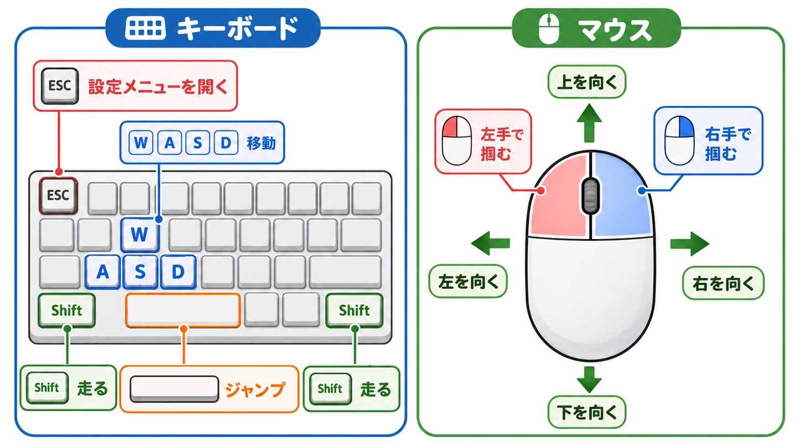
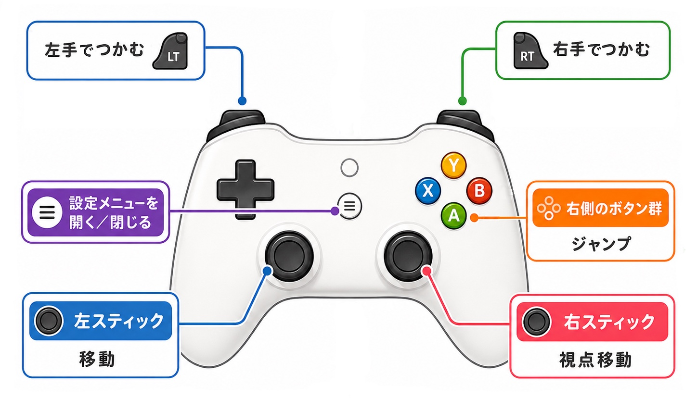

# Bungling Delvers

「フニャフニャのアクティブラグドール 2〜4 人で、罠と怪物だらけのランダム洞窟から、重い宝を抱えて命懸けで持ち帰る協力抽出ゲーム」

Unity + Photon Fusion 2 による協力オンラインゲームの個人開発プロジェクトです（開発期間: devlog記録ベースで 2025-05-28〜2026-07-12、継続中）。

ポートフォリオとして、**ゲームの完成度そのものより「なぜこう実装したか」を一貫して説明できること**を優先しています。資料の読み方は [Docs/README.md](Docs/README.md)、技術構成は [Docs/ARCHITECTURE_OVERVIEW.md](Docs/ARCHITECTURE_OVERVIEW.md) をご参照ください。

2020年9月に「Good Job!」にインスパイアされて製作開始。アクティブラグドールプレイヤーの物理の振動・発散を抑えた同期に難航し、途中から実装はAIに任せて進めるようになる。現在はAIが生成したコードの理解に取り組んでいる。

私は実装方式の判断・実機検証・問題発見を担当し、実装をAIに任せることでイテレーションを短縮しました。プレイヤー同期、掴み・運搬、切断後の復帰を2クライアントで確認し、マップ生成もホストとクライアントの同一再構築まで動作確認しています。3〜4人接続、長時間・不安定回線、ゲームループは未検証または未実装です。

---

## 🎬 動画（Videos）

※ ゲームループ（勝敗・終了条件）は未実装のため、動画は「システム実演」です。ネットワーク同期・物理インタラクションの実装品質をご覧ください。

**まず見る — プレイヤーアクション一覧**（移動・ジャンプ・しゃがみ・掴み・運搬などの操作を一通り実演）

| | |
|---|---|
|  **ネットワーク実機検証 — 応答遅延テスト** Windows（ホスト）とMac（クライアント）の実機2台を1画面に収め、パッド入力→ホスト反映→クライアント反映の遅延を実撮影 |  **切断耐性 — 同一PC2クライアント（ノーカット）** 参加→切断→再参加→ホスト終了時のクライアント安全復帰→ホスト不在時のJoin失敗処理までを編集なしで収録 |

**ホスト生成マップのクライアント同期** 
シード値を変えた3例で、ホストが生成したマップがクライアントに同一再構築される様子

**Bungling Delvers — 開発タイムライン**

### 🕹 実行ファイル（プレイアブルビルド）

Windows / macOS のプレイアブルビルド（テストシーン）を **[Releases](https://github.com/Sprict/REBAKA_Fusion2-portfolio/releases/tag/demo-2026-07-13)** からダウンロードできます。2台（または同一PCで2重起動）で片方が「Host」、もう片方が「Join」を選ぶと、Photon Cloud 経由で同じセッションに接続します。

- 未署名ビルドのため起動時に警告が出ます（Windows: SmartScreen「詳細情報」→「実行」 / macOS: 右クリック→「開く」）。詳細はリリースノートを参照してください。

### 🎮 操作方法（主要操作のみ）

| キーボード＋マウス | ゲームパッド |
|---|---|
|  |  |

| 操作     | キーボード＋マウス     | ゲームパッド     |
| ------ | ------------- | ---------- |
| 移動     | W / A / S / D | 左スティック     |
| 視点移動   | マウス           | 右スティック     |
| ジャンプ   | Space         | 右側の下ボタン    |
| 走る     | Shift         | 左スティック押し込み          |
| 左手で掴む  | マウス左クリック      | LT         |
| 右手で掴む  | マウス右クリック      | RT         |
| 設定メニュー | ESC           | メニューボタン（≡） |

※ 両手で掴む＝左右同時押し。感度・キー割り当ては設定メニューから変更できます。

### 🧪 実機検証環境

| 役割     | マシン                                                                                                             |
| ------ | --------------------------------------------------------------------------------------------------------------- |
| ホスト    | Windows 10 デスクトップ（Intel Core i7-4790K / 16GB RAM / GeForce RTX 4060 Ti）                                         |
| クライアント | MacBook Pro 13-inch 2017（Intel Core i7 デュアルコア / Intel Iris Plus Graphics 650 / 16GB RAM / macOS Ventura 13.7.8） |

世代・OS・GPU 構成の異なる実機 2 台間でネットワーク同期を確認しています。

---

## ✨ 技術ハイライト

### アクティブラグドール物理（ConfigurableJoint + JointDrive）

ConfigurableJoint の Angular Drive を使い、Root・体幹・四肢に異なる JointDrive を割り当てて姿勢を維持しています。バネ強度と減衰比から Drive を生成し、Idle／Walking に応じて四肢の硬さを補間します。
関連: [`Assets/Code/Scripts/Player/RagDollPhysics.cs`](Assets/Code/Scripts/Player/RagDollPhysics.cs) / [`Assets/Code/Scripts/Utils/JointConfigurator.cs`](Assets/Code/Scripts/Utils/JointConfigurator.cs)

### ネットワーク物理同期（ホスト権威 + スナップショット補間）

State Authority側のみで物理を実行し（`HasStateAuthority`ガード）、プロキシ側はローカル物理を止めてホストのスナップショットを補間表示するだけの「純補間プロキシ」に統一しています。プレイヤーだけでなく Obs_Cube 等のピアオブジェクトにも同じ原理を横展開しました。
関連: [`Assets/Code/Scripts/Network/GameNetworkRigidbody.cs`](Assets/Code/Scripts/Network/GameNetworkRigidbody.cs) / [devlog: ピア同期の純補間統一](Docs/devlogs/2026-06-18_peer_sync_pure_interpolation.md)

### 手続きマップ生成（手作りモジュール連結 × ホスト配布 × 自前ナビグラフ）

完全 PCG は不採用としました。モジュール定義をホスト側で抽選・接続し、生成した配置リストを `[Networked]` なマニフェストとしてクライアントへ配布、NavMesh に頼らない自前のパス探索グラフを持たせています。現在は MapNetworkSandbox で単一階層の2クライアント同期まで確認済みで、部屋プレハブのバリエーション、複数階層、メインゲームシーンへの統合は未実装です。
関連: [`Assets/Code/Scripts/Map/MapGenerator.cs`](Assets/Code/Scripts/Map/MapGenerator.cs) / [`Assets/Code/Scripts/Map/MapNetworkDistributor.cs`](Assets/Code/Scripts/Map/MapNetworkDistributor.cs) / [devlog: マップ生成方式決定](Docs/devlogs/2026-06-27_map_generation_decision.md)

### 自作開発ツール

Network Debug HUD（実機での同期状態のリアルタイム可視化）、Preflight checker（統合前のネットワーク配線チェック）、UnusedAssetFinder（未使用アセット検出 Editor 拡張）、SyncMetricsRecorder（同期負荷の計測）などを内製しています。
関連: [`Assets/Code/Scripts/Debugging/NetworkDebugHud.cs`](Assets/Code/Scripts/Debugging/NetworkDebugHud.cs) / [`Assets/UnusedAssetFinder/`](Assets/UnusedAssetFinder/)

---

## 📖 このリポジトリの読み方

**これは抜粋リポジトリです。** サードパーティ SDK・アセット（Photon Fusion 2 SDK、Asset Store 由来アセット）は再配布ライセンスの制約により含めていません。そのため Unity プロジェクトとしてはビルドできません。ゲーム本体は上記の動画を参照してください。

### コード地図（`Assets/Code/`）

| ディレクトリ                 | 内容                                                                   |
| ---------------------- | -------------------------------------------------------------------- |
| `Scripts/Camera/`      | 追従・軌道カメラ制御                                                           |
| `Scripts/Debugging/`   | 実機同期状態を可視化する Network Debug HUD                                       |
| `Scripts/Diagnostics/` | 同期負荷計測（SyncMetricsRecorder）・ラグドールのCSVプロファイラ・ネット診断                    |
| `Scripts/Map/`         | 手作りモジュール連結によるマップ生成・接続トポロジ・ホスト配布・自前ナビグラフ・宝物スポーン計画                     |
| `Scripts/Network/`     | 入力収集、プレイヤー/スポーン管理、Host/JoinロビーUI・ホスト切断復帰、ピア同期物理の純補間サブクラス             |
| `Scripts/Player/`      | アクティブラグドール本体（物理・入力・状態・クライアントプロキシ戦略・ポーズ同期など20+ファイルに責務分離）              |
| `Scripts/Settings/`    | 設定メニュー（感度・リバインド・入力デバイス切替）と設定の永続化                                     |
| `Scripts/Utils/`       | ジョイント設定・デバッグ表示等の共通ユーティリティ                                            |
| `Editor/`              | ProbePlacement（ライトプローブ自動配置）や統合前チェック（Fusion設定重複・シーン配線）の Editor 拡張とテスト |
| `Tests/EditMode/`      | NUnit EditMode テスト（ラグドール・マップ生成・ネットワーク配線等のロジック）                       |

`Assets/Editor/` と `Assets/UnusedAssetFinder/` は上記とは別の、プロジェクト全体向け Editor 拡張です（未使用アセット検出ツールなど）。

### 技術資料

- [`Docs/ARCHITECTURE_OVERVIEW.md`](Docs/ARCHITECTURE_OVERVIEW.md) — 現在のネットワーク物理同期方式
- [`Docs/ARCHITECTURE_FAILURE_MODES.md`](Docs/ARCHITECTURE_FAILURE_MODES.md) — 解決済みの故障、現在の制約、未検証事項
- [`Docs/MY_ROLE.md`](Docs/MY_ROLE.md) — 本人の担当とAIに任せた範囲
- [`Docs/AUTHOR_NOTE.md`](Docs/AUTHOR_NOTE.md) — 本人による掴みジョイント検証の振り返り

設計判断や調査過程を深掘りしたい場合は、[`Docs/README.md`](Docs/README.md)から目的別にdevlogを選べます。devlogには当時の仮説や撤回済みの案も含まれるため、現在の仕様は上記のアーキテクチャ資料を優先してください。

---

## 🛠 技術スタック

- **Unity**: 6000.3.7f1
- **Photon Fusion**: 2.1.0（Host Mode）
- **言語**: C#
- **テスト**: NUnit EditMode（`Assets/Code/Tests/EditMode/`）

---

## License / 利用について

本リポジトリは採用選考・技術レビュー目的の閲覧用です。コード・ドキュメントの著作権は作者に帰属します（All rights reserved）。Photon Fusion 2 は Photon Engine（Exit Games）の製品です。
